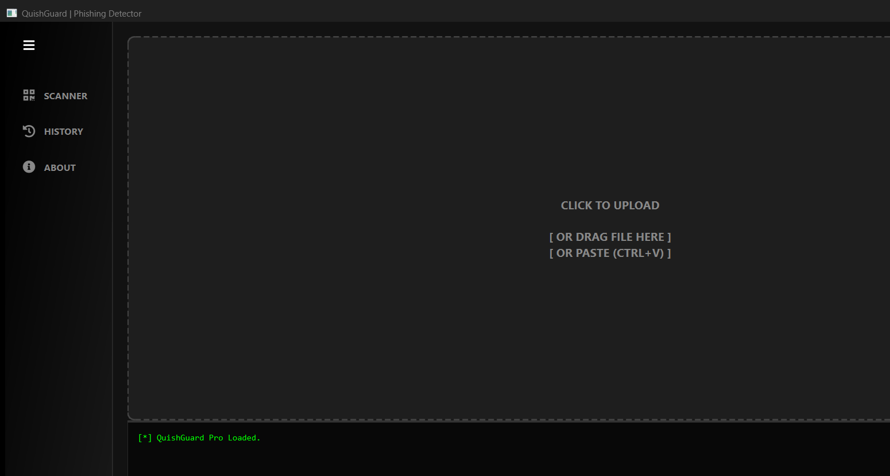

# QuishGuard

A forensic desktop tool that decodes QR codes and unmasks where they actually lead — before you ever visit the link.

## Overview

QuishGuard scans QR codes embedded in images or PDF documents, traces any
redirect chain to the real final destination, and scores how risky that
destination looks — all without opening a browser or visiting the link
itself. It's built for Blue Team / defensive analysis: revealing redirection
chains and suspicious destinations rather than just decoding the raw QR
payload.

## Why

"Quishing" (QR-code phishing) is an increasingly common attack: malicious QR
codes on flyers, parking meters, fake delivery notices, or emails. Unlike a
suspicious link in an email, where hovering shows the real URL before you
click, a QR code hides its destination completely until a camera scans it —
and by then a phone's browser has often already started loading the page.
QuishGuard closes that gap by investigating the destination first.

## Features

### Smart Detection Engine
- **Multi-Format Scanning**: Drag and drop Images (.png, .jpg) or PDF Documents directly into the application.
- **Batch Processing**: Automatically parses multi-page PDFs to identify and analyze every contained QR code.
- **Heuristic Analysis**: Calculates a "Threat Score" based on redirection depth, IP hostnames, and suspicious keywords to categorize links as Safe, Suspicious, or High Risk.

### Forensic Analysis
- **Redirection Tracing**: Unmasks shortened links (e.g., bit.ly, tinyurl) to reveal the final destination server without visiting it.
- **Defanging**: Automatically converts malicious URLs (e.g., `http://malware.com` becomes `hxxp[:]//malware[.]com`) to prevent accidental execution during analysis.
- **Detailed Logs**: Displays the full hop-by-hop path of any link for forensic auditing.

### Professional Reporting
- **Scan History**: Automatically maintains a local audit trail of all previous scans.
- **Export Reports**: Generates timestamped forensic text reports suitable for evidence or documentation.

### Modern UI
- **Cyber-Brutalist Design**: Features a high-contrast Dark Mode interface built with PyQt6.
- **Privacy First**: All analysis occurs locally on the host machine. No files are uploaded to external cloud servers.

## Screenshot



## Tech Stack

- **Language**: Python
- **UI**: PyQt6, QtAwesome (icons)
- **Image/PDF processing**: OpenCV, PyMuPDF
- **QR decoding**: pyzbar (wraps the open-source ZBar library)
- **Networking**: requests (redirect tracing), BeautifulSoup, defang
- **Packaging**: PyInstaller, Git LFS (for the compiled installer)

## How It Works

1. **Scanning** (`src/core/scanner.py`) — reads images with OpenCV and
   renders PDF pages with PyMuPDF, then decodes any QR codes with `pyzbar`.
2. **Redirect tracing** (`src/core/analyzer.py`) — for a decoded URL, makes a
   real HTTP `HEAD` request and manually follows any redirect (up to 10
   hops) to find the true final destination, without ever loading the page
   itself.
3. **Heuristic scoring** — the final destination is scored on redirect
   depth, whether it's a raw IP address, suspicious keywords, direct file
   downloads, and whether it could be reached at all — producing a
   SAFE / SUSPICIOUS / HIGH RISK verdict.
4. **Defanging** — URLs are shown in a defanged form (`hxxp[:]//`) so a
   report can be shared without risk of someone accidentally clicking a live
   malicious link.
5. **UI + history** (`src/ui/`, `src/utils/history.py`) — a PyQt6 desktop
   interface with drag-and-drop, a live console log, and a local audit trail
   of past scans.

## Installation

### For End Users (Recommended)
This project utilizes **Git LFS (Large File Storage)** to host the compiled binary. You do not need Python installed to use this version.

1.  Navigate to the **dist** folder in this repository.
2.  Download the file named **QuishGuard_Setup.exe**.
3.  Run the installer. It will guide you through the setup process and automatically create shortcuts on your Desktop and Start Menu.

### For Developers
If you wish to modify the source code or build the application yourself, follow these steps.

1.  **Clone the repository:**
    ```bash
    git clone https://github.com/JampaniKomal/QuishGuard.git
    ```

2.  **Create and activate a virtual environment:**
    ```bash
    python -m venv venv
    .\venv\Scripts\Activate
    ```

3.  **Install dependencies:**
    ```bash
    pip install -r requirements.txt
    ```

4.  **Run the application:**
    ```bash
    python main.py
    ```

**Note:** on Windows, QR decoding depends on the Microsoft Visual C++ 2013
Redistributable (x64) being installed, since the bundled `pyzbar`/ZBar
library requires it. If you see an error mentioning `libzbar` or a missing
DLL when scanning, install it from Microsoft before anything else.

## Usage

1. Launch the app (or the installed shortcut).
2. Drop an image or PDF onto the scan area (or click to browse, or paste
   from the clipboard with Ctrl+V).
3. Watch the console log for the decoded content and verdict for each QR
   code found.
4. Use **Save Report** to export a timestamped forensic text report, or
   check the **History** tab for a log of all past scans.

## Building from Source
To compile the executable and installer from the source code, use the included build script. This script handles the PyInstaller configuration, dependency collection, and installer generation.

```bash
python build_final.py
```

After the build completes, the distribution files will be available in the `dist` directory.

## Project Structure

  - **src/core/**: Contains the scanner engine (OpenCV/PyMuPDF) and analyzer logic.
  - **src/ui/**: Contains the PyQt6 interface logic and styling definitions.
  - **src/utils/**: Helper utilities for history management.
  - **installer/**: Source code for the custom Setup Wizard and Uninstaller.
  - **dist/**: Destination for compiled executables (tracked via LFS).

## Known Limitations / Roadmap

- Only follows real HTTP-level redirects — does not render pages, so
  JavaScript-driven or meta-refresh redirects are not caught.
- Heuristic/rule-based scoring, not machine-learning based — explainable and
  tunable, but an attacker who knows the rules could evade them.
- No automated test suite yet.
- Local scan history is a plain, unencrypted JSON file.

Planned:
- [ ] **Automated Testing:** Implementation of `pytest` suite for core analysis logic.
- [ ] **CI/CD Pipeline:** GitHub Actions workflow for automated linting and building.
- [ ] **Threat Intelligence:** Integration with VirusTotal API for enhanced reputation scoring.

## License

This project is licensed under the MIT License — see [LICENSE](LICENSE) for details.

## Disclaimer

This tool is developed for educational and defensive purposes only. The developers are not responsible for any misuse of this software. Ensure you have proper authorization before analyzing suspicious files or URLs.

## Acknowledgments

  - **QtAwesome:** For the FontAwesome icon implementation.
  - **PyMuPDF & OpenCV:** For the core document and image processing capabilities.
